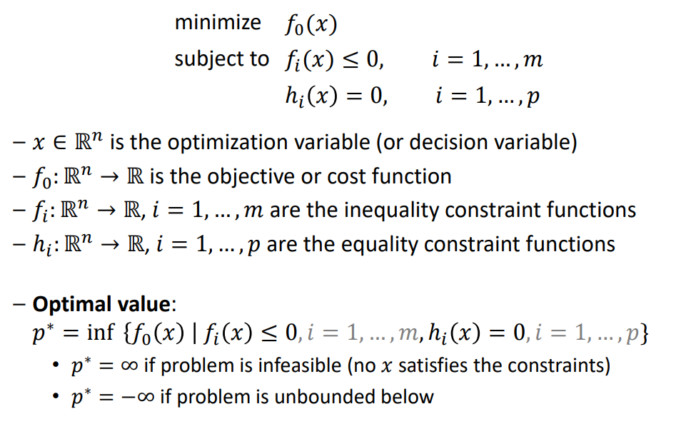
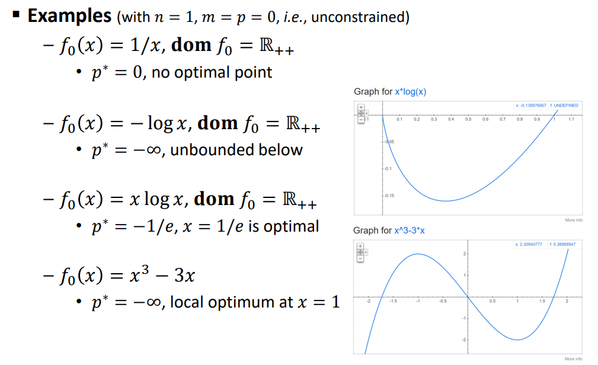
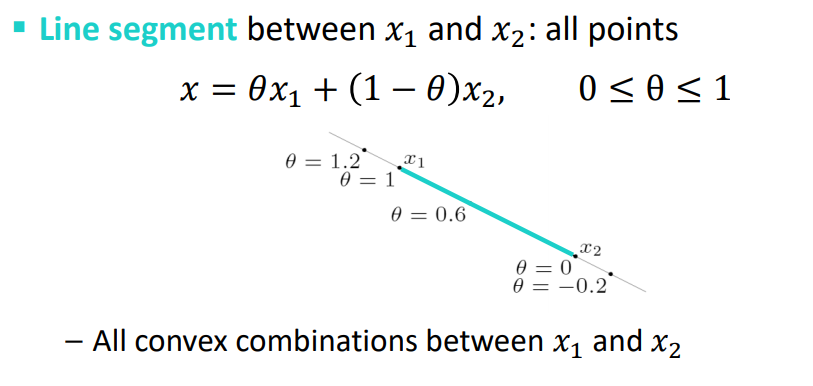
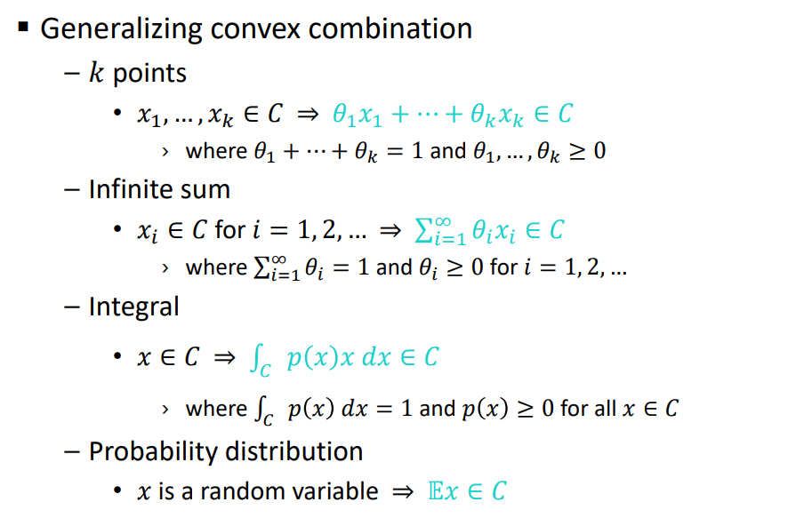
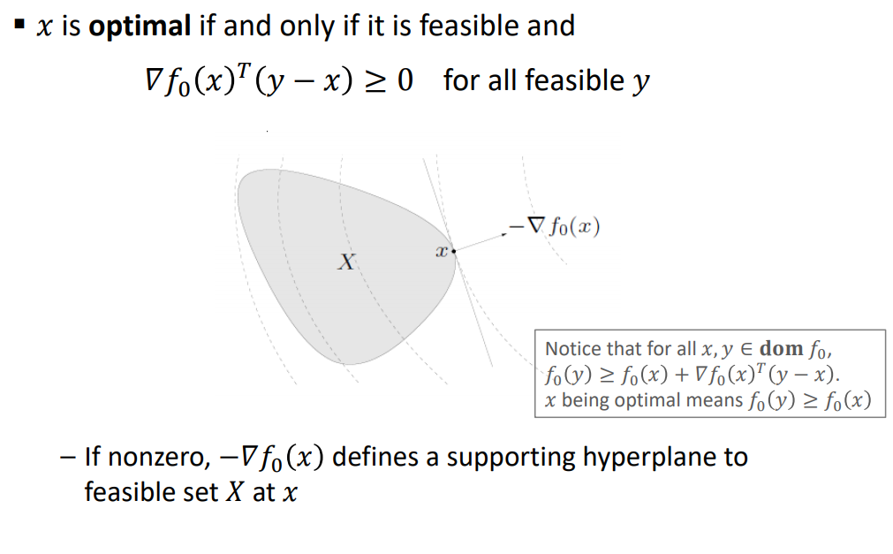
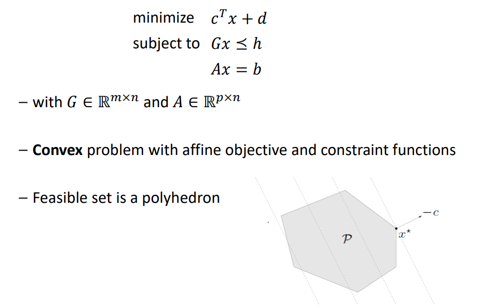
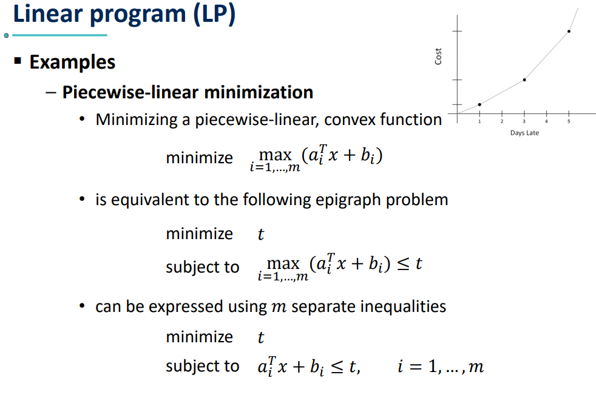
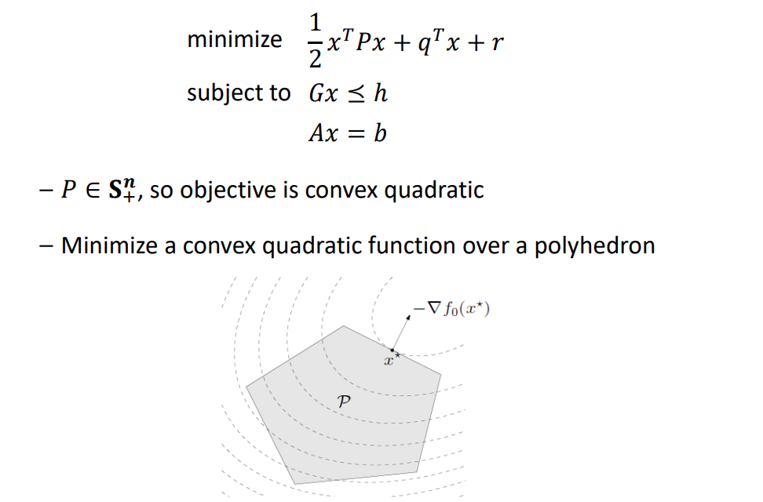

# CONVEX OPTIMIZATION PROBLEMS

## Optimization problem in standard form

## Optimal and locally optimal points

## Convex set
- Line segment
  

- Convex set: contains line segment between any two points 
in the set

## Optimality criterion for differentiable 𝒇𝟎
- 경사 하강법

## Linear program (LP)

- Examples
  - Diet problem
    - Choose quantities 𝑥1, … , 𝑥𝑛 of 𝑛 foods
    - One unit of food 𝑗 costs 𝑐𝑗, contains amount 𝑎𝑖𝑗 of nutrient 𝑖
    - Healthy diet requires nutrient 𝑖 in quantity at least 𝑏𝑖
    - To find cheapest healthy diet, solve
      - minimize 𝑐𝑇𝑥
      - subject to 𝐴𝑥 ⪰ 𝑏, 𝑥 ⪰ 0
- 최소한의 영양소를 섭취하면서 가장 저렴한 식단을 찾아라 -> 최적화

## Quadratic program (QP)
