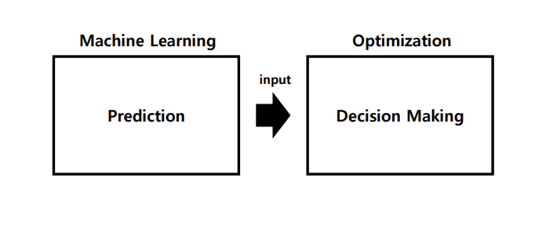
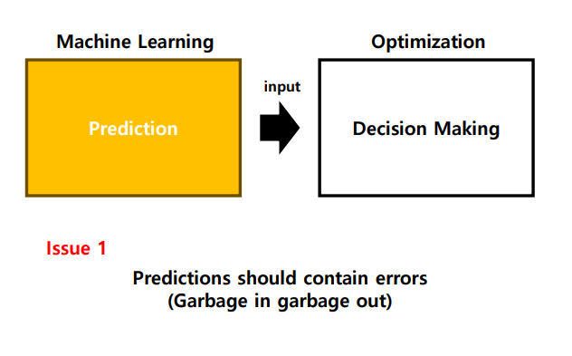
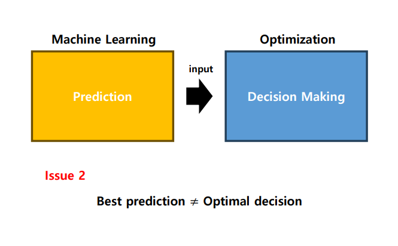
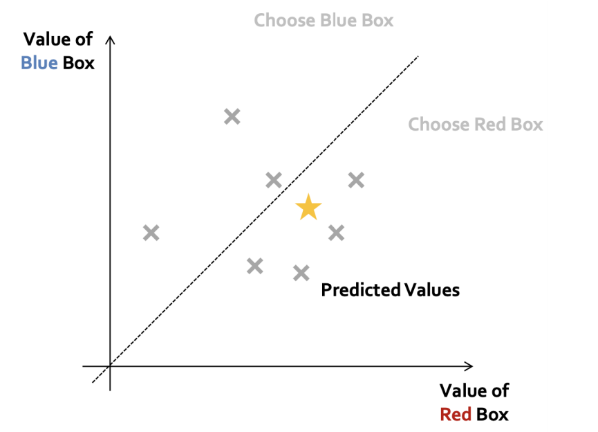
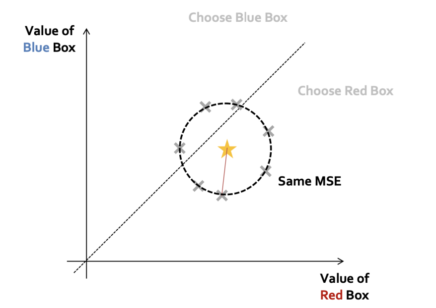
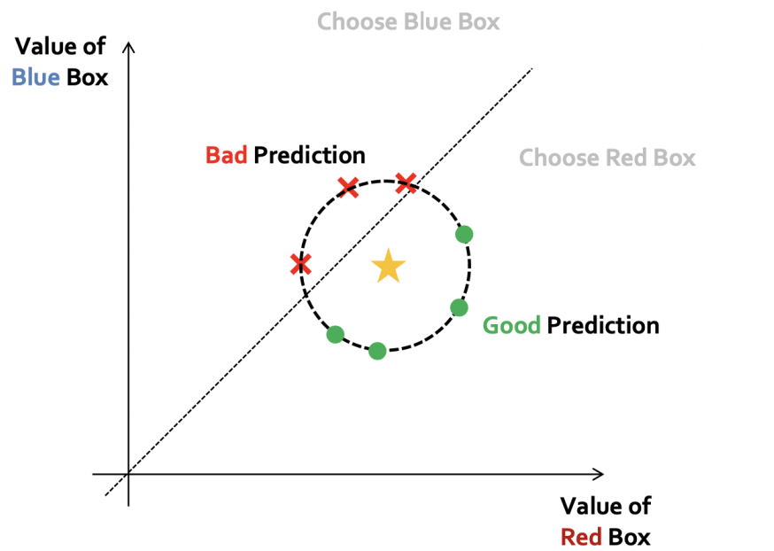
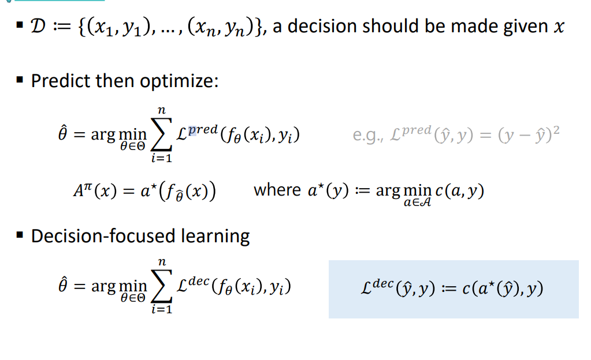

# Decision-Focused Learning

## ML-based decision making process
- 불확실성이 있을 수 있음
- 머신러닝을 통해서 불확실성에 대해 예측 후 의사 결정

- 정확도가 100퍼센트일 수 없음

- 예측을 가장 잘하는 것과 의사결정을 위해서 좋은 예측이 동일하지 않다 -> 최적의 의사결정을 가져오진 않는다

- 예시

- 같은 수준의 예측 수준인데도 불구하고 예측 오류
- 어떤 의사결정을 최종적으로 하느냐

## Decision-focused learning(의사결정 중심학습)
- x라는 값을 가지고 y라는 값을 예측을 해야함

- 예측 오류에서 -> 예측한 값을 가지고 내린 의사결정이 정답을 알고 있을 때 내린 의사결정과 최대한 가까워졌으면 좋겠다