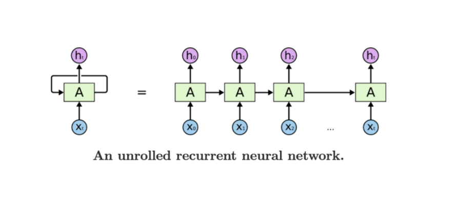
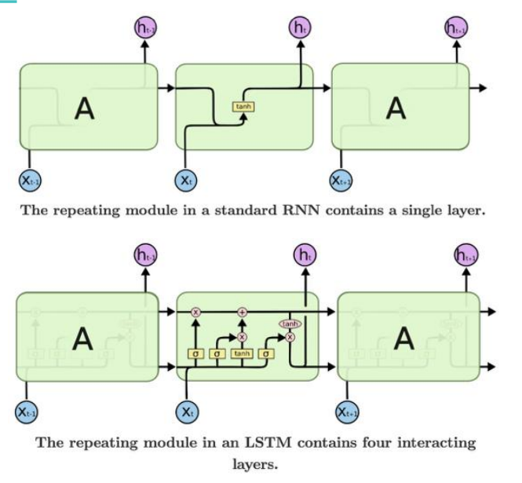
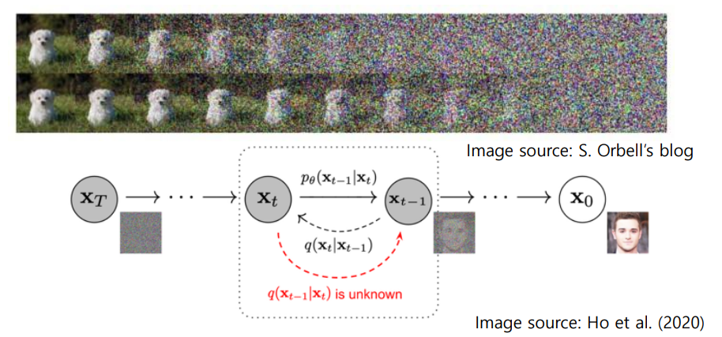
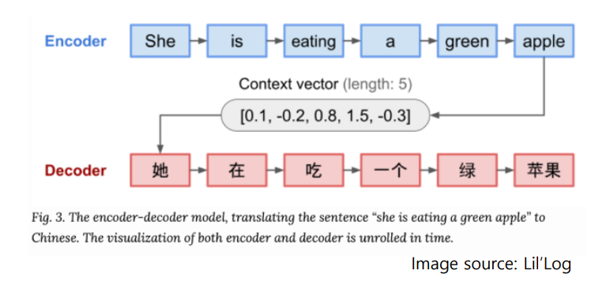

# Deep Learning Models for Time-Series Analysis

## RNN-based models
- Recurrent neural networks(다시 돌아오다)

- RNN 구조의 한계점
  - 같은 구조를 계속해서 반복하기 때문에 input의 영향이 뒤로 갈 수록 점점 미미해지거나 아니면 오히려 너무 지나치게 증폭 될 수 있음
  - 간단하게 말하자면, RNN이 초기 입력값을 잊어버림
  - Vanishing gradient

 

## Long short term memory (LSTM)

 

## Neural ODE
- RNN과 LSTM 모두 관측값이 동일한 간격으로 관츨되었다고 가정
- NeuralODE (Chen et al., 2018)는 일정하지 않게 관측된 데이터도 다룰 수 있도록 hidden state를 continuous하게 설정
  - ANN은 hidden state의 derivative (미분값, 변화량)을 학습

 

## DeepAR

 

## Generative models(생성 모형)
- Generative models vs. discriminative models
  - Discriminative models 데이터의 종류를 판별하는 모형
    - 예를 들면 사진을 바탕으로 개인지 고양이인지 구분
  - Generative models은 새로운 데이터를 만들어내는 모형
    - 예를 들어 여러 이미지를 학습 후 새로운 이미지를 만들어냄

 

## Generative Adversarial Networks (GAN)
- Generator (generative network)
  - 데이터 분포를 학습하여 새로운 데이터를 만들어내고자 함
  - Discriminator를 속이는 것이 목표
- Discriminator (discriminative network)
  - Generator가 생성한 가짜 데이터와 진짜 데이터를 구분하는 것이 목표
- 실시간으로 경쟁을 시킬 수 있다

 

## Diffusion models
- 데이터에 점점 노이즈를 더하면 언젠가는 완전한 노이즈가 됨
- 그 반대 과정을 학습할 수 있다면 노이즈로부터 실제 같은 데이터를 생성해낼 수 있음

 

## Attention-based models

## Sequence-to-sequence models
- sequence-to-sequence (seq2seq) models에서는 input이 sequence로 들어가며 hidden state가 update되고, 이를 바탕으로 output을 sequence로 출력
- Input이 길어지게 되면 이를 기억하기가 어려움
- 따라서 전체 input을 하나로 요약하기보다, input에서 어떤 부분을 더 '집중(attend)'해야하는지 판단하여 사용

 

## Attention is all you need (Transformers)
- Vaswani et al. (2017)는 RNN cell 없이 attention만으로 구성된 Transformer 모형을 제안
- 여러 task에서 매우 높은 성능을 보임
- 가장 큰 장점은 병렬화 시켜 모델을 매우 크게 만들기가 용이하여, 엄청나게 많은 양의 데이터를 학습하는 것이 가능해짐

 

## LLM-based models