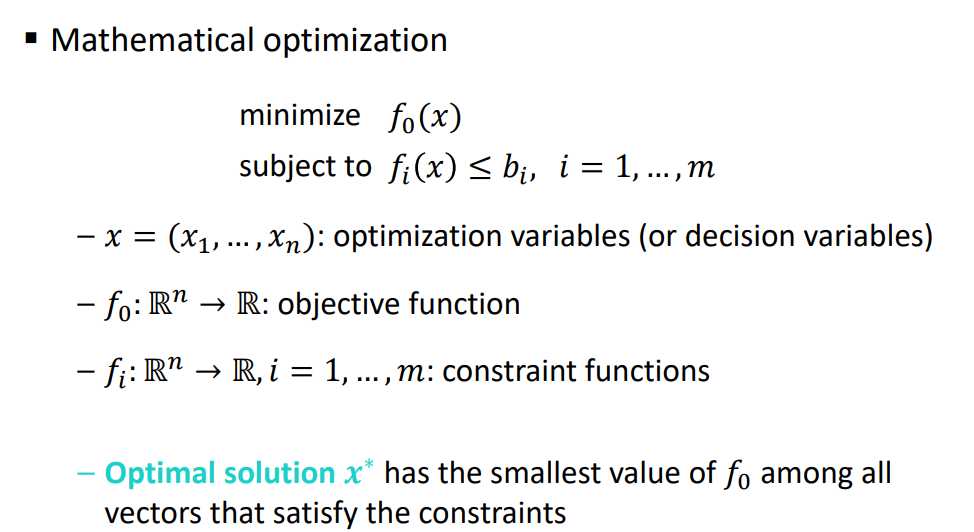
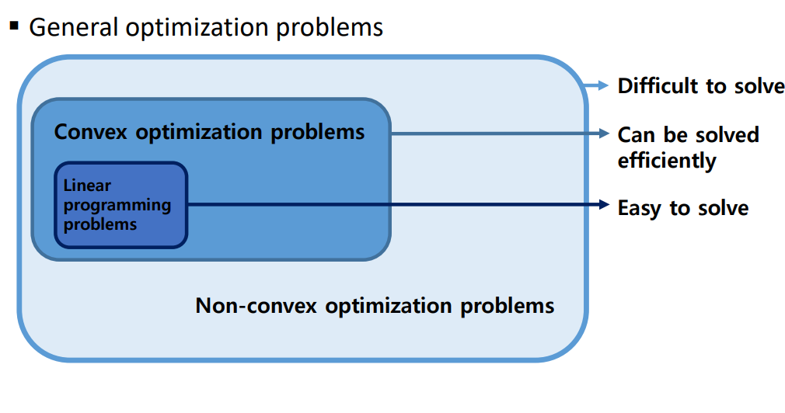
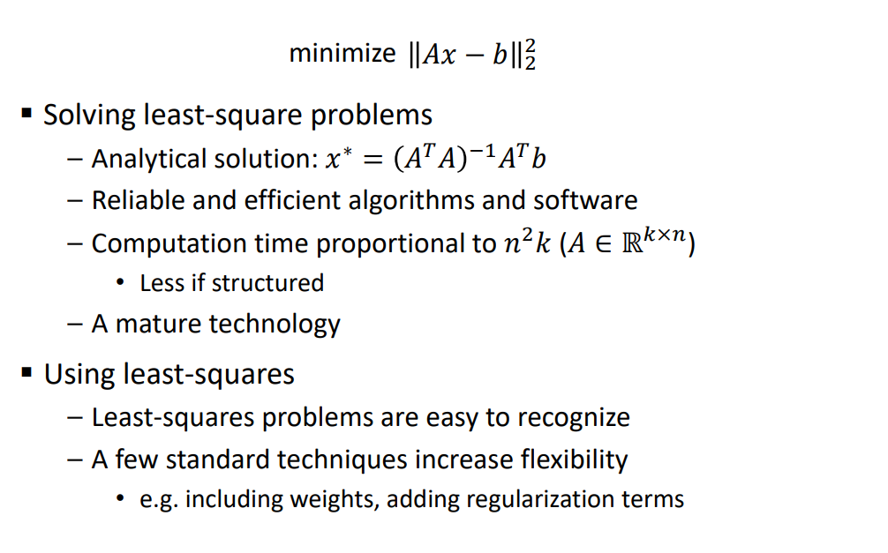
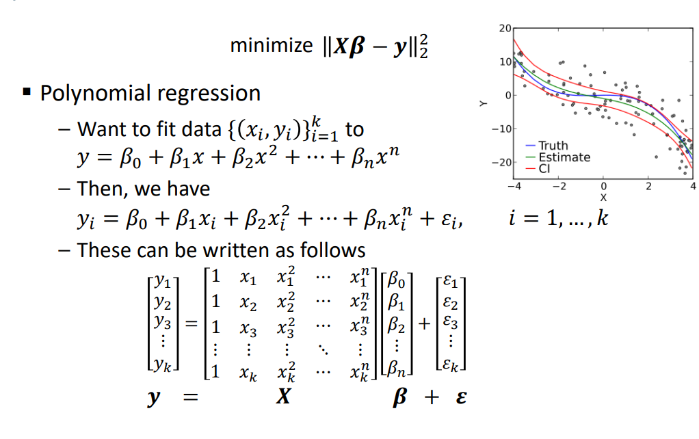
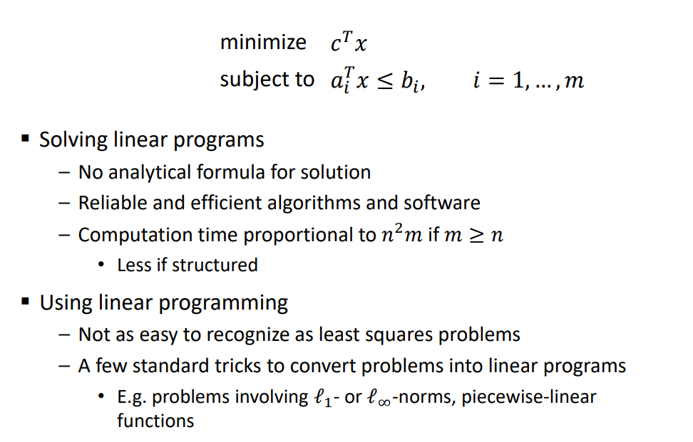
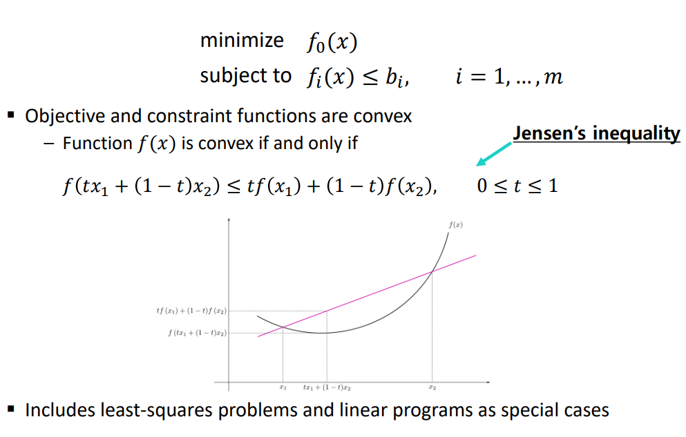

# Introduction to Convex Optimization

## Convex Optimization
- 의사 결정 최적화
- 어떤 제약 조건이 있을 때 최적의 솔루션을 찾아내는 것

## Portfolio optimization
- 어떤 다른 자산들을 얼마나 투자할 것 인가?
- Variables: amounts invested in different assets (stocks, bonds,…)
- Constraints: budget, max/min investment per asset, minimum required return, …
- Objective: overall risk (e.g. return variance)

## Device sizing in electronic circuits
- 전자 회로에서 사이즈 등을 정하는 것
- Variables: device widths and lengths
- Constraints: manufacturing limits, timing requirements, maximum area
- Objective: power consumption

## Data fitting (or statistics, machine learning)
- Variables: model parameters
- Constraints: prior information, parameter limits
- Objective: measure of misfit or prediction error

## Solving optimization problems
- General optimization problems
  - Very difficult to solve
  - Methods involve some compromise(타협이 필요함)

- Exceptions
  - Certain problem classes can be solved efficiently and reliably
    - Least-squares problems
    - Linear programming problems
    - Convex optimization problems

## What is convex optimization?
- 최적화란 산을 오르는 것과 마찬가지
- A problem
  - 많은 봉우리가 있을 수 있다

- A bigger problem
  - 눈을 감고 올라가는 것과 마찬가지
    - 정말 높은 곳인가? 최적화된 곳 인가?

- convex optimization
  - 하나의 산봉우리만 있다
  - 나아가다보면 결국 정상에 올라갈 수 있다

 

## Least-squares

 

## Linear programming

 

## Convex optimization problem

- 장점
  - 상당히 안정적이고 효율적인 알고리즘이 있다
  - Solving convex optimization problems
    - No analytical solution
    - Reliable and efficient algorithms
    - Computation time (roughly) proportional to max{𝑛3, 𝑛2𝑚, 𝐹}, where 𝐹 is cost of evaluating 𝑓𝑖’s and their second derivatives
    - Almost a technology
  
  - Using convex optimization
    - Often difficult to recognize
    - Many tricks for transforming problem into convex form
    - Surprisingly many problems can be solved via convex optimization