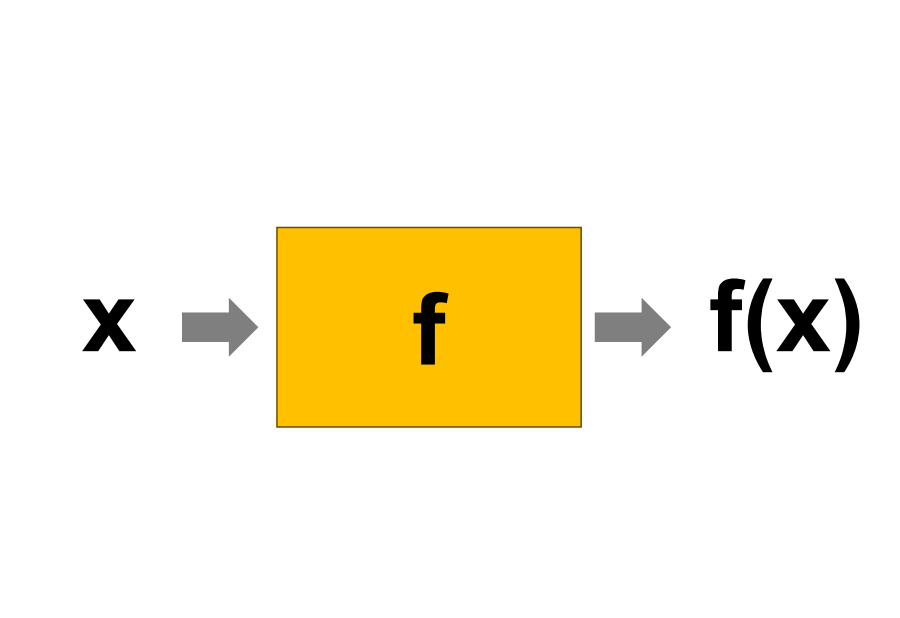
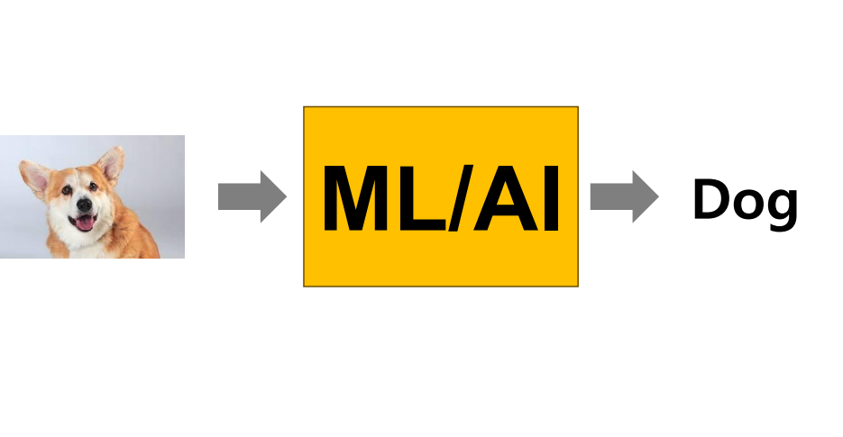
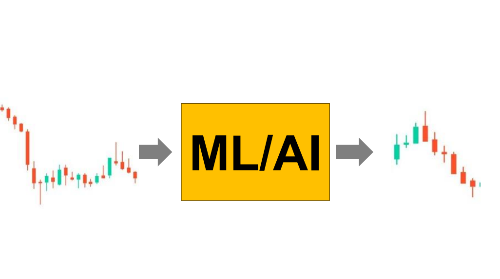
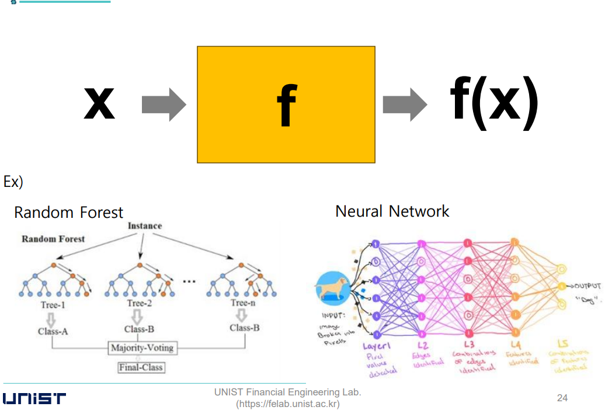

# Introduction to Time-Series Analysis

## 시계열 분석
- 여러 시점에 관측된 실험 데이터를 분석하는 것
- 기존에 사용되는 대부분의 통계적 기법이 바로 적용되기 어려움
  - 기존에는 많은 경우 관측 데이터가 독립적이고 동일한 분포를 가진다고 가정 (independent and identically distributed, i.i.d.)
  - 하지만 시계열 데이터는 인접하여 관측된 데이터의 경우 분명한 관계성이 있음
- 따라서 시계열 분석에서는 이러한 부분을 잘 다룰 수 있어야 함

 

## 예측 모형의 원리
- 함수를 학습하는 과정
- 데이터가 많이 있어야함
- 정답이 잘 표기되어있어야함

 

## Model-driven 방식
- 전통적 기법들은 대부분 model-driven이라 볼 수 있음
  - 계산되는 수식이 큰 틀에서 이미 결정되어있음
  - 데이터 분포에 대한 가정이 있는 경우가 많음
- 장점
  - 도메인 지식을 활용하기 쉬움
  - 분석 결과를 일반화 하기 쉬움
- 단점
  - 데이터나 분석 환경이 복잡할 경우엔 사용하기 어려움

 

## Data-driven 방식
- AI 기법은 대부분 data-driven 방식으로 볼 수 있음
  - 계산 수식이나 데이터의 확률 분포에 대해 특별한 가정이 없음
- 장점
  - 다양한 변수 사이의 복잡한 (일반적으로 비선형적인) 관계성을 반영할 수 있음
- 단점
  - 충분한 양의 데이터가 필요
  - 결과를 해석하기가 다소 어려움

